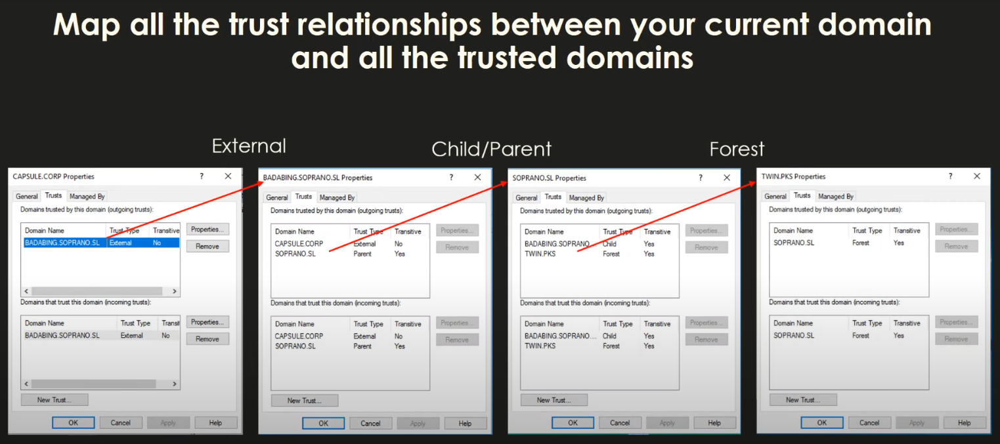
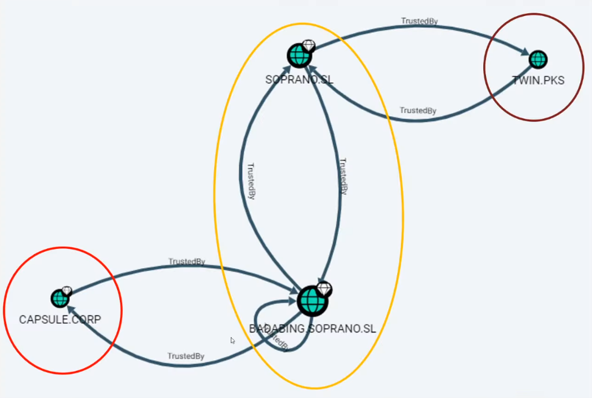

# 📓 03. Trusts

The users can access to other domains in the same forests because they are linked by connections called **Trusts**.

[A trust is a connection from a domain to another](https://docs.microsoft.com/en-us/previous-versions/windows/it-pro/windows-server-2008-r2-and-2008/cc731335\(v=ws.10\)). Not a physical network connection, but a kind of authentication/authorization connection. You may be able to reach computers on the network that are in others domains, but you cannot log in on those computers with your user of this domain. That is what a trust allows you to do.

### Trust direction

A trust is a directed relation where one side is the trusting and the other the trusted. When this link is established, the users of the trusted domain can access to the resources of the trusting domain.

The [**trust direction**](https://docs.microsoft.com/en-us/previous-versions/windows/it-pro/windows-server-2008-r2-and-2008/cc731404\(v=ws.10\)) **is the opposite to the access direction**. You can think that if you trust your friend, you allow her to access to your house and eat your food when she needs it.

```
 (trusting)         trusts        (trusted)
  Domain A  -------------------->  Domain B1|
       outgoing               incoming
       outbound               inbound
                    access
            <--------------------
```

When a trust is directed through your current domain in called an Inbound or Incoming trust. **Incoming trusts allow users of your domain to access the other domain**.

On the other hand there are Outbound or Outgoing trusts, that go from your domain to the other. Therefore the users of the other domain can access to your domain.

And when two domains are connected by both an incoming and an outgoing trust, it is said that they are linked by a bidirectional trust (even if there are really two trusts).

To view the trusts for your domain, see the "**Enum Domain Trusts**" section of the following resource:


[ad-enumeration-cheat-sheet.md](../ad-enumeration-cheat-sheet.md)


Example with: `nltest /domain_trusts`:

```powershell
# Trusts of poke.mon domain:
PS C:\Users\Administrator> nltest /domain_trusts
List of domain trusts:
    0: CONTOSO contoso.local (NT 5) (Direct Outbound) ( Attr: foresttrans )
    1: ITPOKEMON it.poke.mon (NT 5) (Forest: 2) (Direct Outbound) (Direct Inbound) ( Attr: withinforest )
    2: POKEMON poke.mon (NT 5) (Forest Tree Root) (Primary Domain) (Native)
The command completed successfully
```

Here we can see that our current domain is `poke.mon` (cause of the `(Primary Domain)` attribute) and there are a couple of trusts. The outbound trust with `contoso.local` indicates that its users can access to our domain, `poke.mon`. Moreover, there is a second bidirectional trust with `it.poke.mon` that is a subdomain of `poke.mon` and it is in the same forest.

```powershell
# Trusts of contoso.local
PS C:\Users\Anakin> nltest /domain_trusts
List of domain trusts:
    0: POKEMON poke.mon (NT 5) (Direct Inbound) ( Attr: foresttrans )
    1: CONTOSO contoso.local (NT 5) (Forest Tree Root) (Primary Domain) (Native)
The command completed successfully
```

Consequently, if we check the trust of `contoso.local`, we can see an inbound connection from `poke.mon`, which is consistent with the previous information. So users of `contoso.local` can access to `poke.mon`.

### Trust transitivity <a href="#trust-transitivity" id="trust-transitivity"></a>

Moreover, a [trust can be transitive or nontransitive](https://docs.microsoft.com/en-us/previous-versions/windows/it-pro/windows-server-2008-r2-and-2008/cc754612\(v=ws.10\)). A nontransitive trust can only be used by the two sides of the trust, the trusting and the trusted. Whereas a transitive trust can act as a bridge and being used for third domains connected with the domains that are connected by the transitive trust.

```shell
# Three domains connected by trusts:
            (trusting)   trusts   (trusted)  (trusting)   trusts   (trusted)
  Domain A  ------------------->  Domain B --------------------> Domain C
                    access                          access
            <-------------------           <--------------------
```

For example, if the trust between `Domain A` and `Domain B` is transitive, then the users of `Domain C` can access to `Domain A` by traversing both trusts. If the `Domain A --> Domain B` trust was nontransitive, the `Domain C` users couldn't access to `Domain A`, but `Domain B` users could.

Therefore, in relation with the domains in the same forest , all the domains users can access to other domains cause all the parent and child domains are connected through bidirectional transitive trusts. This way, any domain of the forest can traverse the required trusts to access to other domain in the same forests.

In a forest, to allow access from any domain to any other, all the parents and children are connected by a bidirectional transitive trust.

```shell
# contoso.local forest trusts: 
             
              contoso.local
               ^  v   v  ^  
          .----'  |   |  '----.
          |  .----'   '----.  |
          ^  v             v  ^
     it.contoso.local hr.contoso.local
          ^  v 
          |  |
          ^  v
  webs.it.contoso.local
```

So to access to computers of `hr.contoso.local`, a user of `webs.it.contoso.local` must traverse three trusts.

### Trust types

In Active Directory there are several [trust types](https://docs.microsoft.com/en-us/previous-versions/windows/it-pro/windows-server-2008-r2-and-2008/cc730798\(v=ws.10\)#trust-types) for different purposes:

* **Parent-Child**: The default trusts created between a parent domain and its child.
* **Forest**: A trust to share resources between forests. This way any domain of the forest can access to any domain on the other forest (if the direction and transitivity of the trust allow it). If a forest trust is misconfigured, then it can allow to [take control of the other forest](http://www.harmj0y.net/blog/redteaming/not-a-security-boundary-breaking-forest-trusts/).
* **External**: A trust to connect to a specific domain that is in a non trusted forest.
* **Realm**: A special trust to connect Active Directory and a non-Windows domain.
* **Shortcut**: When two domains within the forest communicate often but are not directly connected, you can avoid jumping over many trusts by creating a direct shortcut trust.

### Trust key <a href="#trust-key" id="trust-key"></a>

Technically, when you use a trust, there is a communication between the domain controller of your domain and the domain controller of the target domain (or of an intermediary domain).

How communication is made varies depending of the protocol that is being used (which could be NTLM, Kerberos, etc), but in any case, the domain controllers needs to share a key to keep the communications secure. This key is known as the trust key and it's created when the trust is established.

When a trust is created, a [trust account](https://zer1t0.gitlab.io/posts/attacking\_ad/#trust-accounts) is created in the domain database as if it were an user (with the name finished in `$`). The trust key is then stored as if it was the password of the trust user (in the [NT hash](https://zer1t0.gitlab.io/posts/attacking\_ad/#lm-nt-hash) and [Kerberos keys](https://zer1t0.gitlab.io/posts/attacking\_ad/#user-kerberos-keys)).

### Example with 3 forests



* (FOREST 1) : `CAPSULE.CORP` has trust with **BADABING.SOPRANO.SL** of type external.
* (FOREST 2) : `BADABING.SOPRANO.SL` is child of SOPRANO.SL (trust of type parent/child).
* (FOREST 2) : `SOPRANO.SL` is the root of the forest, i.e. the parent.
* (FOREST 3): `TWIN.PKS`.



* Domains within a forest trust each other.
* Once a single domain is compromised, any domain in the forest is vulnerable to the SIDHistory technique by creating Golden Tickets.
* So, if `BADABING.SOPRANO.SL` is compromised, `SOPRANO.SL` can be compromised using that technique.
* Therefore, what Microsoft "recommends" is that instead of creating 2 domains in the same forest, 2 forests should be created.

### More on trusts <a href="#more-on-trusts" id="more-on-trusts"></a>

To know how trusts can be abused in a pentest, you can check the following posts (a little knowledge in Kerberos is also recommended to read them):

* [It’s All About Trust – Forging Kerberos Trust Tickets to Spoof Access across Active Directory Trusts](https://adsecurity.org/?p=1588)
* [A Guide to Attacking Domain Trusts](http://www.harmj0y.net/blog/redteaming/a-guide-to-attacking-domain-trusts/)
* [Active Directory forest trusts part 1 - How does SID filtering work?](https://dirkjanm.io/active-directory-forest-trusts-part-one-how-does-sid-filtering-work/)
* [Inter-Realm Key Roasting (well… within the first 30 days)](https://blog.xpnsec.com/inter-realm-key-roasting/)
* [Not A Security Boundary: Breaking Forest Trusts](http://www.harmj0y.net/blog/redteaming/not-a-security-boundary-breaking-forest-trusts/)
