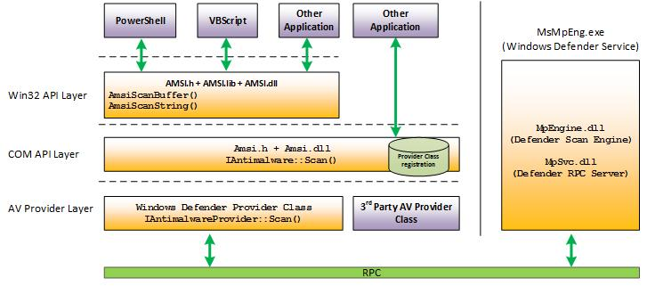

# Theory (AMSI)

Below is an example of how data flows within the Windows security functions.

AMSI will send different response codes based on the results of your scans. Below is a list of AMSI response codes:

* AMSI\_RESULT\_CLEAN = 0
* AMSI\_RESULT\_NOT\_DETECTED = 1
* AMSI\_RESULT\_BLOCKED\_BY\_ADMIN\_START = 16384
* AMSI\_RESULT\_BLOCKED\_BY\_ADMIN\_END = 20479
* AMSI\_RESULT\_DETECTED = 32768

AMSI is fully integrated into the following Windows components:

* User Account Control, or UAC
* PowerShell
* Windows Script Host (wscript and cscript)
* JavaScript and VBScript
* Office VBA macros

AMSI is implemented both in System.Management.Automation.dll and within the CLR itself. When inside the CLR, it is assumed that Defender is already being instrumented; this means that AMSI will only be called when it is loaded from memory.

Third parties can also instrument AMSI in their products using the methods below:

* AMSI Win32 API, [https://docs.microsoft.com/en-us/windows/win32/amsi/antimalware-scan-interface-functions](https://docs.microsoft.com/en-us/windows/win32/amsi/antimalware-scan-interface-functions).
* AMSI COM interface, [https://docs.microsoft.com/en-us/windows/win32/api/amsi/nn-amsi-iamsistream](https://docs.microsoft.com/en-us/windows/win32/api/amsi/nn-amsi-iamsistream)

For more information on integrating AMSI into third-party products, please refer to this Microsoft article, [https://docs.microsoft.com/en-us/windows/win32/amsi/dev-audience](https://docs.microsoft.com/en-us/windows/win32/amsi/dev-audience)
