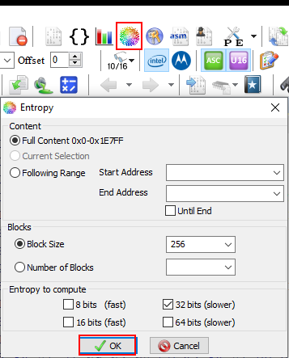

# Basic AV Evasion

## Entropy

File entropy is involved in the detection cycle.

Entropy is a measure of uncertainty or randomness. It is used in association with some encryption or obfuscation technologies. The more randomness in the data, the higher the entropy. The less randomness and more structure, the lower the entropy.

Obfuscation and encryption hide our malicious code from AVs or EDRs but changes the file entropy.

Heuristic analysis used in security products calculates the entropy of a file to detect if there is encrypted data inside and use that information for detection. It is not essential to evade entropy detection but some EDRs trigger alerts for this.

### Check entropy

For this case, we are going to use the Helium Hex Editor tool. To check the entropy we have to do the following:




### Bypass entropy

To evade entropy we can do several things:

* Copy all variables from the data section (i.e., all global variables) and paste them into the text section (or code, inside a function).
* We can add the contents of a binary or DLL to our malicious binary:

```
type C:\Windows\System32\kernel32.dll >> test.exe
```

## Binary details

When we talk about the details of a file or binary, this is what we mean:


### Add details

To add details to a file, we have many ways.



### Steps

1. File -> Open -> Malicious binary
2. Action -> Add from a Resource file (\*res, \*.mui, \*.dll, \*.exe) -> `kernel32.dll` or any other legitimate file (preferably Microsoft).
3. We import the version information:


4\. Save.



If we have a C/C++ code, we can create an .rc file with all the details and compile it:


```

1 VERSIONINFO
FILEVERSION 1,0,0,1
PRODUCTVERSION 1,0,0,1
FILEOS 0x40004
FILETYPE 0x2
{
BLOCK "StringFileInfo"
{
	BLOCK "040904B0"
	{
		VALUE "CompanyName", "Microsoft Corporation"
		VALUE "FileDescription", "Windows NT BASE API Client DLL"
		VALUE "FileVersion", "1.0.0.1 (WinBuild.100001.0010)"
		VALUE "InternalName", "kernel32"
		VALUE "LegalCopyright", "\xA9 Microsoft Corporation. All rights reserved."
		VALUE "OriginalFilename", "kernel32"
		VALUE "ProductName", "Microsoft\xAE Windows\xAE Operating System"
		VALUE "ProductVersion", "1.0.0.1"
	}
}

BLOCK "VarFileInfo"
{
	VALUE "Translation", 0x0409 0x04B0  
}
}
```


The compilation file would look something like this:

```batch
@ECHO OFF

rc version_info.rc
cvtres /MACHINE:x64 /OUT:version_info.o version_info.res
cl.exe /nologo /Ox /MT /W0 /GS- /DNDEBUG /Tc<FILENAME>.cpp /link /OUT:test.exe /SUBSYSTEM:CONSOLE /MACHINE:x64 version_info.o
del *.obj *.o *.res
```



## Binary signature

### Sign binary

```shell
makecert -pe -r -n "CN=Microsoft Root Certificate Authority 2010,O=Microsoft Corporation,L=Redmond,5=Washington,C=US" -sr CurrentUser -ss CA -a sha256 -cy authority -sky signature -sv CA.pvk CA.cer
makecert -pe -n "CN=Microsoft Windows Production PCA 2011,O=Microsoft Corporation,L=Redmond,S=Washington,C=US" -a sha256 -cy end -sky signature -eku 1.3.6.1.5.5.7.3.3,1.3.6.1.4.1.311.10.3.24,1.3.6.1.4.1.311.10.3.6 -ic CA.cer -iv CA.pvk -sv SPC.pvk SPC.cer
pvk2pfx -pvk SPC.pvk -spc SPC.cer -pfx SPC.pfx
signtool sign /f /v SPC.pfx <BINARY>
```

## Hiding console

When we have a source code (for example, C++ or NIM), we need to compile it to generate an .EXE binary. The problem occurs if we compile it as if it were a console application, because when we run it, a console will appear, which is very obvious and can alert the user. To avoid this, we can:

* Compile it for a GUI application.
* Add a line of code that uses a more "stealthy" console.
* Etc.

### For C++ code



For this method, all we have to do is to add the following function in the `main()` function of the source code, at the beginning of everything or after declaring some variables:

```cpp
int main(void) {
	int pid = 0;
	HANDLE hProc = NULL;
	FreeConsole(); // Add this
	...
```

The only disadvantage of this, is that this terminal (**FreeConsole**), appears a fraction of a second (less than the previous one but it appears).



Change the `main()` function to `WinMain()`:

```cpp
int WINAPI WinMain(HINSTANCE hInstance, HINSTANCE hPrevInstance, 
    LPSTR lpCmdLine, int nCmdShow) {
```

Due to this change, we will have to change the compilation from **CONSOLE** type to **WINDOWS** (GUI format).


Example with the VS console, and the `revshell.cpp` file.


```shell
cl.exe /nologo /Ox /MT /W0 /GS- /DNDEBUG /Tcrevshell.cpp /link /OUT:shell.exe /SUBSYSTEM:WINDOWS /MACHINE:x64
```


Remember that when changing the GUI format, we must eliminate all the functions that work only in console, such as `printf()`.




### For NIM code

Change the value of the `--app` parameter from **console** to **gui**:

```bash
nim c -d=mingw --app=gui --cpu=amd64 launcher.nim
```
