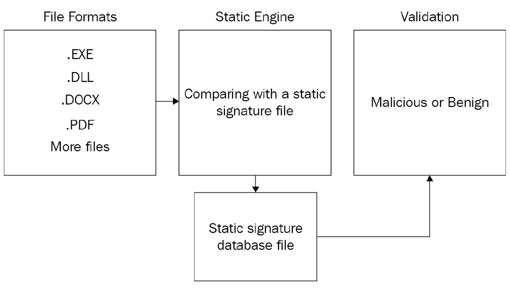
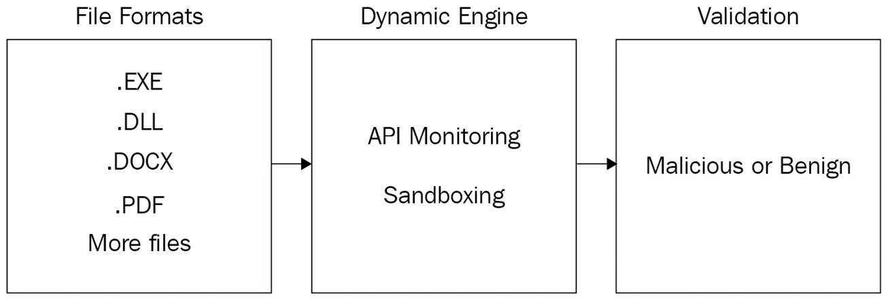
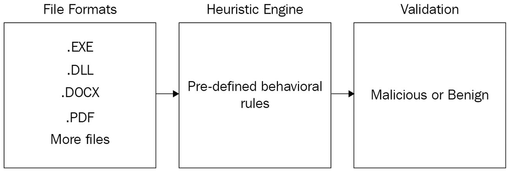
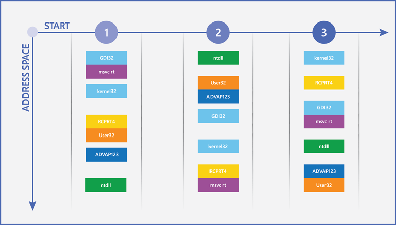

# Theory (AV Evasion)

## Malware

Malware is a portmanteau of malicious software. It is a code, payload or file whose purpose is to infiltrate and cause damage to the endpoint in a variety of ways, including causing disruptions to a computer, server, client or computer network, leaking private information, gaining unauthorized access to information or systems, depriving users of access to information, or unknowingly interfering with the security and privacy of the user's computer.

### Malware types

* **Virus**: Malware that replicates itself in the system.
* **Worm**: Malware where it spreads through a network and infects the endpoints connected to it to carry out some future malicious action.
* **Ransomware**: Malware whose objective is to encrypt the endpoint and demand a financial ransom from the user in order to regain access to their files.
* **Botnet**: This type of malware makes the user a small part of a large network of infected computers (also called zombies). The botnet victims receive the same commands simultaneously from the attacker's server and may even be part of a future attack.
* **Backdoor**: Malware that leaves a "backdoor" open in the target, providing the attacker with continuous access to the user's endpoint.
* **PUP**: PUP stands for Potentially Unwanted Programs. These are software programs that may be unwanted, despite the possibility that users have consented to their download. They can slow down your computer, display a bunch of annoying ads, add toolbars that steal browser space, collect private information, etc.
* **Trojan**: Malware that behaves as if it were a legitimate and innocent application within the operating system and contains malicious functionality.
* **Downloader**: Malware that downloads and executes from the Internet some other malicious file to harm the user.
* **Dropper**: Droppers are a subtype of malware that have the purpose of releasing or "dropping" another malicious file.
* **Rootkit**: Malware found in the lower levels of the operating system that usually have many privileges.
* **Spyware**: Malware whose objective is to spy on the user and steal his information in order to sell it for economic purposes.
* **Scareware**: A form of malware that uses social engineering techniques to cause commotion, anxiety, or a perceived threat to manipulate the user into installing or purchasing software they do not need.


**Malware types are classified based not only on the malware's primary purpose or target, but also on its capabilities**. An example is the **WannaCry** malware, which is classified as **ransonware** (because it encrypts the victim's files and demands a ransom), **trojan** (it masquerades as a legitimate disk partitioning utility) and **worm** (because of its ability to move laterally and infect other computers on the network).


### Protection systems

Antivirus software is the most basic type of protection system used to defend endpoints against malware. But there are other alternatives, both to protect the home user and the business user from cybercriminals, either at the endpoint or network level;

* **Firewall**: A system for monitoring, blocking and identifying network-based threats based on a predefined policy.
* **IDS/IPS**: IDS and IPS provide network-level security, based on generic signatures, which inspect network packets and look for malicious patterns or malicious flows.
* **EDR**: The goal of EDR systems is to protect the business user from malware attacks by responding in real time to any type of event defined as malicious.
* **DLP**: The sole purpose of DLP is to stop and report on sensitive data being exfiltrated from the organization, whether on portable media (thumb drive/key drives), email, upload to a file server, or more.

## Antivirus

Antivirus software aims to detect and prevent the spread of malicious files and processes within the operating system.

Over time, antivirus engines have improved and become more intelligent and sophisticated, containing one or more of the following engines:

* Static engine
* Dynamic engine (api monitoring + sandboxing)
* Heuristic engine
* Unpacking engine

### Static engine

The goal of the static engine is to identify threats using static signatures. During a scan, the antivirus software's static engine performs comparisons of existing files in the operating system with a signature database, and in this way can identify malware. But the drawback with this engine is that it is impossible to identify all malware that exists using static signatures, as any change to a particular malware file can bypass a particular static signature and thus bypass the static engine altogether.

### Dynamic engine

The purpose of the **dynamic engine** is to check the file at runtime, through different methods, which are:

* **API monitoring**: intercept API calls in the operating system and detect malicious ones. API monitoring is performed by system hooks.
* **Sandboxing**: Sandboxing is a computer security technique based on running programs or applications in a limited virtual space, in which all processes can be controlled without affecting the rest of the computer. This allows malware to be detected and analyzed by running it within a virtual environment, rather than directly in the memory of the physical computer itself. However, one of the disadvantages of this method is that the malware runs only for a limited time, which allows attackers to know the time period in which the malware is running in a sandbox.

### Heuristic engine

The **heuristic engine** determines a score for each file by performing a statistical analysis that combines the methodologies of the static and dynamic engine and, based on the behavior (through predefined rules), can detect whether the file is malicious or not. For example, a predefined rule can be where a process tries to interact with the lsass.exe process. However, the disadvantage of this engine is that it can lead to false positives, where attackers can perform "trial and error" to learn how the engine works and subsequently, bypass it.

### Unpacker engine

The unpacker engine reveals malware payloads that have undergone "packing", or compression, to hide a malicious pattern and avoid detection by the static engine.

## Approaches in antivirus research

The goal in antivirus research is to bypass it completely and execute malicious code on the user's endpoint. To achieve this, there are two approaches:

* Find a vulnerability in the antivirus software (rare).
* Use a method of evading detection (the most common).


Antivirus vulnerabilities: [https://cve.mitre.org/cgi-bin/cvekey.cgi?keyword=antivirus](https://cve.mitre.org/cgi-bin/cvekey.cgi?keyword=antivirus)


### Security mechanisms (Windows)

The main security mechanisms implemented in Windows are the following:

* ASLR – Address Space Layout Randomization
* DEP – Data Execution Prevention
* SEHOP – Structured Exception Handling Overwrite Protection

ASLR is a Windows security mechanism that prevents malware from exploiting security vulnerabilities based on expected memory locations in the operating system by randomizing this memory address space and loading crucial DLLs at memory addresses that were randomized at boot time:

Another memory security mechanism called DEP prevents code from executing in specific memory regions marked as non-executable memory page, which in turn, "prevents" (or hardens) attempts to exploit buffer overflow vulnerabilities.

Finally, the runtime security mechanism called SEHOP prevents malicious code exploitation attempts by abusing the SEH operating system structure through the SEH overwrite exploitation technique.

### Protection rings

In computing, protection rings are mechanisms implemented in CPUs to protect data and functionality from failure (improving fault tolerance) and malicious behavior (providing computer security). Each ring of this mechanism has a unique role in the overall operation of the operating system:



The rings are organized in a hierarchy from most privileged (most trusted, usually numbered zero) to least privileged (least trusted, usually with the highest ring number). In most operating systems (such as Windows), **ring 0** is the most privileged level and interacts most directly with the physical hardware, such as the CPU and memory.

In general, antivirus tends to deploy its inspection mechanisms in the lower rings, especially as a driver. The lower rings provide more visibility to the antivirus engine, allowing it to inspect the actions performed on the operating system, which can detect malicious actions.

### Windows protection rings

* **Ring 3**: This ring is where the user interacts with the operating system, primarily through the graphical user interface (GUI) or command line. It is not really that ring 3 can interact directly with ring 0, but rather that any action performed by a program or process is transferred to the lower rings. Example: A user saves a file, the operating system handles it by calling a Windows API function which, in turn, transfers control to the kernel (ring 0), where it handles the operation by transferring the logical instructions to the final bits, which are then written to a sector of the computer's hard disk.
* **Ring 2 and 1**: These are generally designed for device drivers. In a modern operating system, these rings are mostly not used.
* **Ring 0**: Ring 0, the kernel, is the lowest ring of the operating system and therefore also the most privileged, where its main purpose is to translate back-to-back actions issued by the higher rings to the hardware level and vice versa. For malware authors, accessing this layer is the best as it offers the lowest visibility of the operating system to obtain more critical and interesting data from the endpoints.

Antivirus software is installed on a ring lower than ring 3 but not on ring 0, since the only programs that run on that ring are drivers or other strictly hardware-related software.

### Vulnerabilities in an antivirus

* **Insufficient permissions on the static signature file**: If a static signature has insufficient permissions, any user with insufficient privileges can delete the contents of the file, resulting in an empty signature.
* ****[**Unquoted Service Path**](../service-escalation/unquoted-service-paths.md): When you create a service within the Windows operating system whose executable path contains spaces and is not enclosed in quotes, the service has an Unquoted Service Path vulnerability. Since we only want to bypass the antivirus, we can use this vulnerability to prevent it from loading itself or one of its components.
* ****[**DLL hijacking**](../service-escalation/dll-hijacking.md): Vulnerability to arbitrarily load a DLL. In the context of antivirus software, we can make it load and execute a malicious DLL that disables the antivirus itself or some of its components in order to evade detections.
* **Buffer overflow**

## Tips for antivirus bypass research

* Use the latest version of the antivirus software.
* Update the signature database.
* Turn off the Internet connection while performing the investigation, as we do not want the antivirus software to make contact with an external server and sign a bypass technique that we have discovered.
* Use the latest version of the operating system with the latest knowledge base (KB) for the bypass to be effective.
* Instead of using VirusTotal to scan our malware, we recommend using [AntiScan.Me](https://antiscan.me), as it does not share any information with antivirus vendors and security companies.


When we have bypassed the antivirus, it is always good to know which engine has been bypassed (static, dynamic or heuristic).


## Process injection

Process injection is self-explanatory and is used to bypass the dynamic engines of an antivirus. The reason attackers use this technique is because antivirus vendors themselves rely on process or code injection to inspect processes running on the system, in addition to implementing them themselves to detect malicious behavior. This is a double-edged sword, as we can take advantage of this technique to inject our malicious code into a legitimate process.

Another concept that we must learn is the process address space, which is a space that is assigned to each process in the operating system according to the amount of memory that the computer has at that moment. Once assigned, this process will have a set of memory address spaces. Each of these has a different purpose.

### Process-injection steps


Recall that the ultimate goal of the technique is the injection of a code, but it can also be the injection of a DLL or a complete executable file (EXE).


The following steps are required to achieve process injection:

1. Identify a process to inject a code.
2. Receive a handle from the selected process to access its process address space.
3. Allocate a virtual memory address space. This is because that is where we will inject and execute the code. We can also assign an execution flag if necessary.
4. Perform the code injection in the memory address space allocated in the selected process.
5. Execute the injected code.

