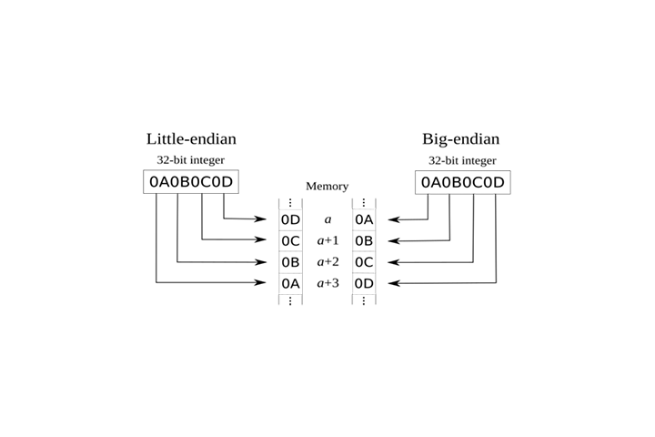

# Theory (Operating System)

## Computer architecture <a href="#firstheading" id="firstheading"></a>

The Von Neumann architecture consists, in general, of the following elements:

* Central Processing Unit (CPU)
  * Control Unit (CU)
  * Arithmetic/Logic Unit (ALU)
  * Registers
* Memory Unit
* Input/Output Devices
  * Storage
  * Keyboard
  * Display


## Memory

In computing, memory (also known as primary memory) is the location of temporary data and instructions for running programs, which is the main location used by the CPU to retrieve and process data. Memory must be fast at storing and retrieving data and instructions because it is used so frequently.

There are two main types of memory:

* Cache
* Random access memory (RAM)

### Cache

Cache memory is usually located inside the CPU itself and is therefore extremely fast compared to RAM, as it operates at the same clock speed as the CPU. The disadvantage of this type of memory is that it is very limited in size and is very sophisticated and expensive to manufacture because it is so close to the CPU core.

There are 3 levels of cache memory, the only difference between them is the size and proximity to the CPU core:

* Level 1 Cache: L1 is usually part of the CPU chip itself and is both the smallest and the fastest to access. Its size is often restricted to between 8 KB and 64 KB.
* Level 2 Cache: L2 cache is slower than the L1 cache but bigger in size. Where an L1 cache may measure in kilobytes, modern L2 memory caches measure in megabytes.
* Level 3 Cache: L3 is larger than L2 (measured in megabytes), slower than L1/L2, but faster than RAM.

### RAM

RAM is located far away from the CPU cores and is much slower than cache memory but larger (from gigabytes to terabytes).

Recall that memory contains memory addresses, and in the past they were 32-bit, meaning a maximum size of 4 GB. Today, with 64-bit addresses, we have up to 18.5 million terabytes, so unique memory addresses should not be a problem.

An example of how RAM works is as follows:

* When a process or program is executed, all its data and instructions are moved from the storage unit to RAM.
* If the CPU needs to access the data and instructions of that program, it retrieves them from RAM, since retrieving them from the storage unit would be much slower.
* When a program is closed, its data is either deleted or made available for reuse from RAM.

RAM is divided into 5 segments:


### Memory addresses

> In [computing](https://en.wikipedia.org/wiki/Computing), a **memory address** is a reference to a specific [memory](https://en.wikipedia.org/wiki/Computer\_memory) location used at various levels by [software](https://en.wikipedia.org/wiki/Software) and [hardware](https://en.wikipedia.org/wiki/Computer\_hardware). Memory addresses are fixed-length sequences of [digits](https://en.wikipedia.org/wiki/Numerical\_digit) conventionally displayed and manipulated as [unsigned](https://en.wikipedia.org/wiki/Signedness) [integers](https://en.wikipedia.org/wiki/Integer\_\(computing\)). Such numerical semantic bases itself upon features of CPU (such as the [instruction pointer](https://en.wikipedia.org/wiki/Instruction\_pointer) and incremental [address registers](https://en.wikipedia.org/wiki/Memory\_address\_register)), as well upon use of the memory like an [array](https://en.wikipedia.org/wiki/Array\_data\_structure) endorsed by various [programming languages](https://en.wikipedia.org/wiki/Programming\_language). Source: Wikipedia

Next, we will show an example with C code:

```c
#include <stdio.h>

int main() {
  int a = 5;
  int *pointer_a = &a;
  int *other_pointer = pointer_a;
  printf("Memory address of variable a: %p\n", pointer_a);
  printf("Value of the \"other_pointer\": %p\n", other_pointer);
  printf("Memory address value: %i\n", *pointer_a);

  printf("\n[*] Change the value of the variable a\n");
  *other_pointer = 12;
  printf("New value: %i\n", a);
}

```

When a variable is created in C, it is assigned a memory address. The memory address in hexadecimal format is the location where the variable is stored in the computer.

* `&<VARIABLE>`: Memory address.
* `*<NAME>`: Pointer.

With the pointer that has as value the memory address of a variable, we can print 2 things:

* The memory address.
* The value pointed to by that memory address.

### Stack vs Heap

C has three different pools of memory.

* **static**: global variable storage, permanent for the entire run of the program.
* **stack**: local variable storage (automatic, continuous memory).
* **heap**: dynamic storage (large pool of memory, not allocated in contiguous order).

Let's explain the stack and heap.

### Stack

The call stack, execution stack, function stack, control stack, runtime stack or simply call stack is a dynamic data structure that stores information about the active subroutines of a running program. When we make a call to a function, a block at the top of the stack is reserved to store the local variables along with some data necessary to ensure the proper functioning of the structure (such as the address to which the thread will have to return when the function terminates). After returning, the block of the stack occupied by the caller is freed for later use if necessary.

It is called execution stack because it is a data structure that works under the concept of LIFO (last in first out). This makes it easier to keep track of the blocks to be released, since it will be the one at the top of the stack.

There can be multiple execution stacks in a program when it is multithreaded; each thread has its own stack with which it will keep control of its function calls.


### Heap

The free heap, free zone, free storage or heap is a dynamic data structure used to store data in execution. Unlike the execution heap that only stores the variables declared in the blocks prior to their execution, the heap allows to reserve memory dynamically, that is, it is the one in charge of making the "magic" of dynamic memory happen. The global and static variables are also stored in it.

As this data structure does not follow any methodology, it is a bit complicated to keep control of the reserved memory blocks since spaces can be occupied and freed at any time.


### Address Endianness

The endianness (of an address) is the order or sequence of its bytes that are stored or retrieved from memory, where there are 2 types of endianness:

* **Little-Endian**: The little-end byte of the address is filled/retrieved first from right to left.
* **Big-Endian**: The big-end byte of the address is filled/retrieved first from left to right.



## IO/Storage

Input/output devices are devices such as display, USB, mouse, storage unit (or secondary memory), etc., where the processor can access and control these via bus interfaces (acting as "highways") to transfer data and addresses through the use of electrical loads for binary data. Each Bus has a capacity of bits (or electrical charges) that it can carry simultaneously.

The storage unit (secondary memory) stores permanent data but being farther away from the CPU and transporting the data over bus interfaces such as SATA or USB, makes it slower than the primary memory. Unlike primary memory, which is volatile and stores temporary data and instructions while programs are running, the storage unit stores permanent data, such as operating system files or entire applications and their data.

Today, hard disk drives (HDD) are still used but there is a better alternative to this as solid state drives (SSD) due to a design similar to RAM.

## Speed

After looking at the computer architecture we know two main things that influence speed:

* The distance between the component and the CPU core.
* The amount of data to be transported.

Let's name the components from the fastest to the slowest:

* Registers
* L1 Cache
* L2 Cache
* L3 Cache
* RAM
* Storage

## CPU Architecture

The CPU (Central Processing Unit) is the main processing unit of a computer that contains the Control Unit (CU) and the Arithmetic/Logic Unit (ALU):

* Control Unit (CU): responsible for moving and controlling data.
* Arithmetic/Logic Unit (ALU): It is responsible for performing various arithmetic and logical calculations as requested by a program through assembly instructions.

The efficiency and manner in which a CPU processes its instructions depends on its instruction set architecture (ISA):

* RISC architecture: processes more single instructions, which requires more cycles, but each cycle is shorter and consumes less power.
* CISC architecture: Processes a smaller number of more complex instructions, which requires fewer cycles but each instruction takes longer and consumes more power.

### Clock Speed & Clock Cycle

Each CPU has a clock speed that indicates its overall speed. Each clock tick executes a clock cycle that processes a basic instruction, which is performed by the CU or AU.

The frequency in a CPU at which cycles occur is counted in cycles per second or Hertz. So, if a CPU has a speed of 2.0 GHz, it can execute 2 billion cycles every second, per core. This means that if the processors have more cores (like today), it can have several cycles at the same time.


### Instruction Cycle

An instruction cycle is the cycle it takes the CPU to process a single machine instruction, which consists of four stages:

* Fetch
* Decode
* Execute
* Store



While the picture shows that in stage 3 arithmetic instructions such as "add, sub, etc..." are executed by the ALU, with other types of instructions they are executed by CU.


Depending on the CPU architecture and the complexity of the instruction, each instruction cycle takes several clock cycles to finish. Once an instruction cycle finishes, the CU moves on to the next instruction and executes the same cycle on it, as shown in the following image:

.png>)

In the above graphic, instructions are processed sequentially (as it was in the past) but today, thanks to multithreading and multicore design, several instructions can be processed in parallel by having several instruction/clock cycles running at the same time.



Remember that each type of processor (Intel x86/ARM) has its own instruction set architectures, and each architecture can also be represented in various syntax formats.


### Instruction Set Architectures (ISA)

ISA specifies the syntax and semantics of the assembly language in each architecture, as well as affecting the form and execution order of instructions. It consists of 4 main components:

* **Instructions**: Operand\_list opcode format of the instruction to be processed. An example in assembly language: `add rax, 2`
* **Registers**: Temporarily stores addresses, instructions or operands.
* **Memory Addresses**: Address where data/instructions are stored.
* **Data Types**: Self-explanatory.

The main instruction set architectures are:

* **Complex Instruction Set Computer** (CISC)
* **Reduced Instruction Set Computer** (RISC)

#### CISC vs. RISC

* **Usage**: CISC is used in Intel and AMD processors in most computers and servers, while RISC is used in ARM and Apple processors in most smartphones and some modern laptops.
* **Power Consumption**: CISC uses more power consumption than RISC.
* **Complexity**: CISC favors complex instructions, while RISC favors simple instructions.
* **Instruction Execution Time**: The instruction execution time in CISC is variable (i.e. multiple clock cycles), while in RISC it is fixed (i.e. one clock cycle).
* **Total instructions per program**: CISC uses fewer total instructions, while RISC uses more.
* **Optimization**: In CISC it depends on hardware optimization, while in RISC it depends on software optimization.

.png>)

### Registers

We know that the fastest component of an ordernador is the registers but these have a limited size (they can only hold a few bytes of data at a time). There are 2 common types of registers:

* **Data Registers**: Used to store system call instructions/arguments.
  * **rax**, **rbx**, **rcx**, **rdx**: Main data registers.
  * **rdi**, **rsi**: Usually used for the target and source operands of the instructions.
  * **r8**, **r9**, **r10**: Secondary data registers (only used when all the previous registers are occupied).
* **Pointer registers**: Used to store pointers to specific important addresses.
  * **rbp** (Base Pointer): Pointer pointing to the beginning of the Stack.
  * **rsp** (Stack Pointer): Pointer pointing to the current location within the Stack (top of the Stack).
  * **rip** (Instruction Pointer): Pointer that points to the next instruction.

### Sub-Registers

Sub-registers

A sub-record is a small part of a record. However, this part is not of any size, for example, a 64-bit register can have the following sizes for sub-records:

* One 8-bit byte.
* 2 bytes of 16 bits.
* 4 bytes of 32 bits.

Example:



Each sub-register can be used and accessed by itself.


| Bytes   | Bits    | Name                        | Example    |
| ------- | ------- | --------------------------- | ---------- |
| 16 bits | 2 bytes | **base name**               | `ax`       |
| 8 bits  | 1 byte  | base name but ends with l/h | `al`, `ah` |
| 32 bits | 4 bytes | **e** + **base name**       | `eax`      |
| 64 bits | 8 bytes | **r** + **base name**       | `rax`      |

## Program

A computer program is a sequence of instructions, written to perform a specific task on a computer.

### How is a program executed?

In one way or another, all code in any program must be converted into machine instructions, because these instructions are the only thing a processor (CPU) can understand.

Depending on the programming language, the code can be compiled, interpreted or a mixture of both.

#### Compiled Language

Compilers take a whole program as input and translate it to an executable binary code in several steps.

We can run the binary code only on the machine on which we compiled it. That’s because the binary code depends on the hardware and is not portable.

The compilation step is required only once. Afterward, we can run the binary code as many times as we want.

Because compilers process whole programs, they can catch some errors and warn us to correct them. Those are syntax and type errors. Compilation fails if they are present.

Types of compiled language - **C**, **C++**, **C#**, **CLEO**, **COBOL**, etc.



Example:




```c
#include <stdio.h>

int main() {
    printf("Hello Word\n");
}
```




```bash
gcc example.c -o example # Compilation
./example # Execution
Hello World
```



#### Interpreted Language

Interpreters read and execute the program at hand instruction by instruction. After being read, each instruction is translated into the machine’s binary code and run.

Unlike compilers, the interpreters do not produce a binary executable file. Each time we run a program, we invoke the interpreter. It then reads and executes the program one instruction at a time.

That’s why it must be present in the computer’s RAM whenever we run a program. In contrast to interpreters, we need compilers only during compilation.

On the other hand, unlike the compilers, the interpreters catch all the errors at runtime.

Interpreted language ranges - **JavaScript**, **Perl**, **Python**, **BASIC**, etc.



Example:




```python
print("Hello World")
```




```bash
python3 ./program.py
Hello World
```



#### Compiled and interpreted language (Java)

The Java language is special because it is not compiled to machine instructions as such, but neither is it directly interpreted. The process to execute a program written in Java is as follows:

* Convert Java code to bytecode using the Java compiler (javac).
* The bytecode is a binary code that can only be understood by the JVM (Java Virtual Machine).
* The bytecode is interpreted by the JVM to machine instructions.

Example:



```java
public class example {
  public static void main(String[] args) {
    System.out.println("Hello World");
  }
}
```



```bash
javac example.java # Convert java code to bytecode
java example # Bytecode is interpreted
Hello World
```



### High Level vs Low Level

In the past, applications had to be written in assembler for each processor, so it was not easy to develop an application for multiple processors. Then high-level languages (such as C) started to appear to make it possible to write a single, easy-to-understand code that could run on any processor without having to rewrite it for each processor, where compilers were very important to achieve this.

Then, when high-level code is compiled, it is translated into assembly instructions for the processor for which it is being compiled, which is then assembled into machine code to run on the processor.

Today, there are interpreted languages, such as PHP, Python, JavaScript and others, which are not compiled, but interpreted at runtime. Interpreted languages use pre-built libraries to execute their instructions, which are usually written and compiled in other high-level languages (C/C++).

## Process

A process is an instance of a program in execution.

### How to create a process?

Let's see an example with the C language.




```c
#include <stdio.h>
#include <stdlib.h>
#include <unistd.h>

int main() {
  int result = fork();
  if (result != 0) {
    printf("This is the parent process.\n");
  } else {
    printf("This is the child process.\n");
  }
}
```


```bash
gcc fork.c -o fork
./fork
This is the parent process.
This is the child process.
```



```c
#include <stdio.h>
#include <stdlib.h>
#include <unistd.h>

int main() {
  int integer = 4;
  int newProcess = fork();
  if (newProcess != 0) {
    printf("This is the parent process, value: %i\n", integer);
    integer = 8;
  } else {
    printf("This is the child process, value: %i\n", integer);
    integer = 12;
  }
  printf("Final result of the variable: %i\n", integer);
}
```

```bash
gcc fork.c -o fork
./fork
This is the parent process, value: 4
Final result of the variable: 8
This is the child process, value: 4
Final result of the variable: 12
```




```c
#include <stdio.h>
#include <sys/types.h>
int main()
{
  fork();
  fork();
  fork();
  printf("hello\n");
  return 0;
}
```


```
gcc fork.c -o fork
./fork

hello
hello
hello
hello
hello
hello
hello
hello
```





When executing this program, it will already be a process itself, but with the fork() function we are creating a child process.

> Fork system call is used for creating a new process, which is called **child process**, which runs concurrently with the process that makes the `fork()` call (parent process). After a new child process is created, both processes will execute the next instruction following the fork() system call. A child process uses the same pc(program counter), same CPU registers, same open files which use in the parent process.
>
> It takes no parameters and returns an integer value. Below are different values returned by fork():
>
> **Negative Value**: creation of a child process was unsuccessful.
>
> **Zero**: Returned to the newly created child process.
>
> **Positive value**: Returned to parent or caller. The value contains process ID of newly created child process.

Here is a more advanced example:

```c
#include <stdio.h>
#include <stdlib.h>
#include <unistd.h>

int main() {
    int integer = 1;
    for (int i = 0; i < 4; i++) {
        int result = fork();
        if (result != 0) {
            integer++;
            break;
        } else {
            integer += 2;
        }
    }
    printf("I am process %i, my father is %i, and the value is: %i\n",
        getpid(), getppid(), integer);
}

```


A simpler example can be done in our Linux terminal to visualize the process tree:

```
pstree
```


### Wait for a process

With C we can wait for a child process to terminate. This can be achieved by using the `wait()` function. For example, if we want to execute the command "`ls`" in the child process before the parent (which will execute "`ps`"), we can do the following:

```c
#include <stdio.h>
#include <stdlib.h>
#include <unistd.h>
#include <sys/wait.h>

int main() {
  int result = fork();

  if (result < 0) {
    printf("[!] Fork call failed.\n");
    exit(-1);
  }

  if (result != 0) {
    wait(NULL);
    printf("[i] Parent process - ps output:\n");
    execlp("ps", "ps", (char*)0);
  } else {
    printf("[i] Child process - ls output:\n");
    execlp("ls", "ls", (char*)0);
    // The printf will only be printed if the command fails:
    printf("There has been an error.\n");
  }
}
```

```bash
gcc wait.c -o wait
./wait
[i] ls output:
wait  wait.c
[i] ps output:
    PID TTY          TIME CMD
  69260 pts/2    00:00:01 zsh
  69268 pts/2    00:00:00 zsh
  69276 pts/2    00:00:00 gitstatusd-linu
  70954 pts/2    00:00:00 ps
```

## File Descriptor

File descriptor is integer that uniquely identifies an open file of the process.

**File Descriptor table**: File descriptor table is the collection of integer array indices that are file descriptors in which elements are pointers to file table entries. One unique file descriptors table is provided in operating system for each process.

**File Table Entry**: File table entries is a structure In-memory surrogate for an open file, which is created when process request to opens file and these entries maintains file position.

**Standard File Descriptors**: When any process starts, then that process file descriptors table’s fd(file descriptor) 0, 1, 2 open automatically, (By default) each of these 3 fd references file table entry for a file named /dev/tty

**/dev/tty**: In-memory surrogate for the terminal.

* **Read from stdin** => **read from fd 0** : Whenever we write any character from keyboard, it read from stdin through fd 0 and save to file named /dev/tty.
* **Write to stdout** => **write to fd 1** : Whenever we see any output to the video screen, it’s from the file named /dev/tty and written to stdout in screen through fd 1.
* **Write to stderr** => **write to fd 2** : We see any error to the video screen, it is also from that file write to stderr in screen through fd 2.

### Modify a file descriptor

Modifying a file descriptor can be useful for the use of pipelines. For example, we know that the first fd (file descriptor) is **stdin**, but if we want to work with the input of a pipe (or the output of a program through the pipe), we can remove the stdin and replace it with the pipe.

## Pipes

Conceptually, a pipe is a connection between two processes, such that the standard output from one process becomes the standard input of the other process. In UNIX Operating System, Pipes are useful for communication between related processes(inter-process communication).

* Pipe is one-way communication only i.e we can use a pipe such that One process write to the pipe, and the other process reads from the pipe. It opens a pipe, which is an area of main memory that is treated as a _**“virtual file”**_.
* The pipe can be used by the creating process, as well as all its child processes, for reading and writing. One process can write to this “virtual file” or pipe and another related process can read from it.
* If a process tries to read before something is written to the pipe, the process is suspended until something is written. This is why there is no need to use the wait() function in C. This is also seen when we execute the following command: `ps | grep root`
* The pipe system call finds the first two available positions in the process’s open file table and allocates them for the read and write ends of the pipe.

**Syntax in C language:**

```c
int pipe(int pipe1[2]);
```

Parameters:

* `pipe1[0]` will be the fd(file descriptor) for the read end of pipe.
* `pipe1[1]` will be the fd for the write end of pipe.

Returns:

* **0** on Success.
* **-1** on error.

### Communication between processes using pipes

```c
#include <stdio.h>
#include <stdlib.h>
#include <unistd.h>
#include <string.h>

int main(int argc, char *argv[]) {
  int pipe1[2];
  pipe(pipe1);
  char s[64];

  if (fork()) {
    // Parent process (read)
    close(pipe1[1]);
    read(pipe1[0], s, 64);
    close(pipe1[0]);
    printf("I am the parent process and I have read from the descriptor %i the string: %s\n", pipe1[0], s);
  } else {
    // Child process (write)
    strcpy(s, "Hello World");
    close(pipe1[0]); // We close the reading (0) of the pipe.
    write(pipe1[1], s, strlen(s)); // Write (1) in the pipe.
    close(pipe1[1]);
    printf("I am the child process and I have written in the descriptor %i with the string: %s\n", pipe1[1], s);
  }
}
```

### Modify a file descriptor (Practice)

```c
#include <stdio.h>
#include <stdlib.h>
#include <unistd.h>
#include <string.h>

int main(int argc, char *argv[]) {
  int pipe1[2];
  pipe(pipe1);
  char s[64];

  if (fork()) {
    // Parent process (read)
    close(pipe1[1]); // We close the writing (1) of the pipeline.
    close(0); // We close the file descriptor stdin (0).
    dup(pipe1[0]); // Replace stdin by the pipe with file descriptor 0 (read).
    close(pipe1[0]); // Close the pipeline with file descriptor 0, but only the first one created (at position 3).
    read(0, s, 64); // Read from stdin, store in variable s, only a total of 64 bytes.
    printf("I am the parent process and I have read from the stdin where the string is: %s\n", s);
  } else {
    // Child process (write)
    strcpy(s, "Hello World");
    close(pipe1[0]); // We close the reading (0) of the pipe.
    close(1); // We close the file descriptor stdout (1).
    dup(pipe1[1]); // Replace stdout by the pipe with file descriptor 1 (write).
    close(pipe1[1]); // Close the pipeline with file descriptor 1, but only the first one created (in position 4).
    printf("%s\n", s); // stdout from the pipe.
  }
}

```

Example with 2 Linux commands:



```c
#include <stdio.h>
#include <stdlib.h>
#include <string.h>
#include <unistd.h>

int main() {
  int pipe1[2];
  pipe(pipe1);

  if(fork()) {
    // Parent process (cut)
    close(pipe1[1]);
    close(0);
    dup(pipe1[0]);
    close(pipe1[0]);
    execlp("cut", "cut", "-c5-12", NULL);
    printf("Error cut\n");
  } else {
    // Child process (ps)
    close(pipe1[0]);
    close(1);
    dup(pipe1[1]);
    close(pipe1[1]);
    execlp("ps", "ps", "-efl", NULL);
    printf("Error ps\n");
  }
}
```







Example with 3 Linux commands where we redirect the output to a file:

```c
#include <stdio.h>
#include <stdlib.h>
#include <string.h>
#include <unistd.h>

int main(int argc, char **argv) {
  if (argc != 2) {
    printf("Use: ./v2 <FILE>");
    exit(-1);
  }
  int pipe1[2], pipe2[2];
  pipe(pipe2);

  if(fork()) {
    // Grandfathering process (sort)
    close(pipe2[1]);
    close(0);
    dup(pipe2[0]);
    close(pipe2[0]);

    close(1);
    open(argv[1], O_WRONLY | O_CREAT | O_TRUNC, 0755);
    execlp("sort", "sort", "-u", NULL);
    printf("Error sort\n");
  } else {
    pipe(pipe1);
    if (fork()) {
      // Parent process (cut)

      // stdin
      close(pipe1[1]);
      close(0);
      dup(pipe1[0]);
      close(pipe1[0]);

      // stdout
      close(pipe2[0]);
      close(1);
      dup(pipe2[1]);
      close(pipe2[1]);

      execlp("cut", "cut", "-c5-12", NULL);
      printf("Error cut\n");
    } else {
      // Child process (ps)
      close(pipe1[0]);
      close(1);
      dup(pipe1[1]);
      close(pipe1[1]);
      close(pipe2[0]);
      close(pipe2[1]);
      execlp("ps", "ps", "-efl", NULL);
      printf("Error ps\n");
    }
  }
}

```

## Thread

A **thread** is a **single sequence stream within in a process**. Because threads have some of the properties of processes, they are sometimes called _lightweight processes_.

### Difference between a process and a thread

Threads are not independent of one other like processes as a result threads shares with other threads their code section, data section and OS resources like open files and signals. But, like process, a thread has its own program counter (PC), a register set, and a stack space.

### Why Multithreading?

Threads are popular way to improve application through **parallelism**. For example, in a browser, multiple tabs can be different threads. MS word uses multiple threads, one thread to format the text, other thread to process inputs, etc. Threads operate faster than processes due to following reasons:

1. **Thread creation is much faster**: Threads require less overhead than "forking" or spawning a new process because the system does not initialize a new system virtual memory space and environment for the process.
2. **Context switching between threads is much faster**.
3. **Threads can be terminated easily**
4. **Communication between threads is faster**.

### Thread Basics

* Thread operations include thread creation, termination, synchronization (joins,blocking), scheduling, data management and process interaction.
* A thread does not maintain a list of created threads, nor does it know the thread that created it.
* All threads within a process share the same address space.
* Threads in the same process share:
  * Process instructions
  * Most data
  * open files (descriptors)
  * signals and signal handlers
  * current working directory
  * User and group id
* Each thread has a unique:
  * Thread ID
  * set of registers, stack pointer
  * stack for local variables, return addresses
  * signal mask
  * priority
  * Return value: `errno`
* **pthread** functions return "**0**" if OK.


Remember that to compile C code using threads, we have to specify the parameter `-lpthread`


Let's show a simple example of how to declare and create a thread in C:

```c
#include <stdio.h>
#include <stdlib.h>
#include <pthread.h>

void *thread_func(void *arg) {
  printf("I am another thread.\n");
  pthread_exit(0);
}

int main() {
  pthread_t thread; // Declare a thread.
  // Create thread:
  pthread_create(&thread, NULL, thread_func, NULL);
  // wait for termination of another thread:
  pthread_join(thread, NULL);
  printf("I am the main thread.\n");
}
```

Here is another example where we pass an argument:



```c
#include <stdio.h>
#include <stdlib.h>
#include <pthread.h>

void *thread_func(void *arg) {
  // To receive an argument (in this case of type int), we do the following:
  // 1. We convert the void pointer (arg) to an int pointer: (int*)arg
  // 2. To get the pointer value, we simply add the *: *(int*)arg
  int value_from_main_thread = *(int*)arg;
  printf("I am another thread, the value is: %i\n", value_from_main_thread);
  pthread_exit(0);
}

int main() {
  pthread_t thread;
  int value = 5;
  pthread_create(&thread, NULL, thread_func, &value);
  pthread_join(thread, NULL);
  printf("I am the main thread.\n");
}
```



```c
#include <stdio.h>
#include <stdlib.h>
#include <pthread.h>

void *thread_func(void *arg) {
  int value_from_main_thread = *(int*)arg;
  printf("I am another thread, the value is: %i\n", value_from_main_thread);
  pthread_exit(0);
}

int main() {
  pthread_t thread1, thread2;
  int value1 = 5, value2 = 20;
  pthread_create(&thread1, NULL, thread_func, &value1);
  pthread_create(&thread2, NULL, thread_func, &value2);
  pthread_join(thread1, NULL);
  pthread_join(thread2, NULL);
  printf("I am the main thread.\n");
}
```

In this example we use 3 threads, in which 2 of them are created by us. The order of execution of these can vary.



Next, we are going to present a C code that performs a parallel addition of the elements of an array:

```c
#include <stdio.h>
#include <stdlib.h>
#include <pthread.h>

#define SIZE 100

int num_threads; // Int
int *array; // Array
int *thread_result; // Array

void *sum(void *arg) {
  int id_thread = *(int*)arg;
  int nums_to_sum = SIZE / num_threads;
  int start = nums_to_sum * id_thread; // 1->25, 26->50, 51->75, 76->100
  int end = start + nums_to_sum;

  // Next is to make sure we add up all the numbers:
  if (id_thread == num_threads - 1) {
    end = SIZE;
  }

  int sum = 0;

  for (int i = start; i < end; i++) {
    sum += array[i];
  }
  thread_result[id_thread] = sum;
  printf("[i] The thread %i has finished and its result is: %i\n", id_thread, sum);
  pthread_exit(0);
}

int main(int argc, char **argv) {
  if (argc != 2) {
    printf("[!] Use: ./test <THREADS>\n");
    exit(-1);
  }
  num_threads = atoi(argv[1]);
  array = malloc(sizeof(int) * SIZE);
  thread_result = malloc(sizeof(int) * num_threads);

  for (int i = 0; i < SIZE; i++) {
    array[i] = i + 1; // [1, 2, 3, ..., 100]
  }

  pthread_t threads[num_threads];
  int threads_ids[num_threads];
  int total = 0;

  for (int i = 0; i < num_threads; i++) {
    threads_ids[i] = i;
    pthread_create(&threads[i], NULL, sum, (void*)&threads_ids[i]);
  }

  for (int i = 0; i < num_threads; i++) {
    pthread_join(threads[i], NULL);
    total += thread_result[i];
  }

  printf("[+] Total: %i\n", total);

  free(array);
  free(thread_result);
}
```

## Socket

A socket is a communication endpoint for sending and receiving data. There are many types of socket, such as Internet, Bluetooth, infrared, etc. In this case, we will talk more about the Internet socket.

### Internet socket

An Internet socket is a process within a computer network node that serves as an endpoint for sending and receiving data over the network, allowing processes to communicate between different hosts. An Internet socket is identified externally to other hosts by its socket address, which is the triad of transport protocol (TCP/UDP), IP address and port number.



```python
#!/usr/bin/python3

import socket
import threading

host = "127.0.0.1"
port = 4444

def main():
    server = socket.socket(socket.AF_INET, socket.SOCK_STREAM)
    server.bind((host, port))
    server.listen(5)
    print(f"[*] Listing on {host}:{port}")
    while True:
        client, address = server.accept()
        print(f"[*] Accepted connection from {address[0]}:{address[1]}")
        client_handler = threading.Thread(target=handle_client, args=(client,))
        client_handler.start()

def handle_client(client_socket):
    with client_socket as sock:
        request = sock.recv(1024)
        print(f'[*] Received: {request.decode("utf-8")}')
        sock.send(b"ACK")

if __name__ == "__main__":
    main()

```



```python
import socket

target_host = "127.0.0.1"
target_port = 4444

# We first create a socket object with the AF_INET and SOCK_STREAM parameters:
# - AF_INET parameter indicates we’ll use a standard IPv4 address or hostname.
# - SOCK_STREAM indicates that this will be a TCP client. 
client = socket.socket(socket.AF_INET, socket.SOCK_STREAM)

# client connect:
client.connect((target_host,target_port))

# send some data:
client.send(b"GET / HTTP 1.1\r\nHost: google.com\r\n\r\n")

# receive some data:
response = client.recv(4096)

print(response.decode())
client.close()
```


