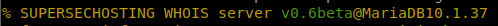

# 43 - WHOIS

### **Theory**

**WHOIS** (pronounced as the phrase "who is") is a request and response protocol that is widely used to query databases that store the registered or assigned users of an Internet resource, such as a domain name, IP address block, or autonomous system, but is also used for a wider range of other information. The domain registrar is responsible for maintaining the WHOIS records for the domain names it leases. The WHOIS server responds with various information related to the requested domain. Of particular interest, we can find out:

* Registrar WHOIS server
* Registrar URL
* Record creation date
* Record update date
* Registrant info (unless withheld for privacy): Name, organization, address, phone number, among others.
* Admin contact info and address (unless withheld for privacy)
* Tech contact info and address (unless withheld for privacy)

### Enumeration



`whois` and **reverse WHOIS lookup** will give you a good set of top-level top-level domains to work with.

### whois

When companies or individuals register a domain name, they have to provide identifying information, such as mailing address, telephone number and e-mail address, to a domain registrar. Anyone can query this information using the `whois` command. Many online services provide whois information; however, it is generally faster and more convenient to use your local whois client. The syntax is `whois DOMAIN_NAME`, where DOMAIN\_NAME is the domain you are trying to get more information about. Example:

```bash
whois <DOMAIN_NAME>
```

The information gathered can be inspected for new attack surfaces, such as social engineering or technical attacks. For example, depending on the scope of the penetration test, an attack against the admin user's email server or DNS servers could be considered, assuming they are owned by your customer and within the scope of the penetration test.

It is important to note that due to automated tools abusing WHOIS queries to collect email addresses, many WHOIS services take measures against this. For example, they may redact email addresses. In addition, many registrants subscribe to privacy services to prevent their email addresses from being collected by spammers and keep their information private.

### **Reverse IP Lookup**

[VidewDNS.info](https://viewdns.info) offers **Reverse IP Lookup.** Initially, each web server would use one or more IP addresses; however, today, it is common to come across shared hosting servers. With shared hosting, one IP address is shared among many different web servers with different domain names. With reverse IP lookup, starting from a domain name or an IP address, you can find the other domain names using a specific IP address(es).



Gets all the information that a whois service has about a domain:

```bash
whois -h <HOST> -p <PORT> "<DOMAIN>"
echo "domain.ltd" | nc -vn <HOST> <PORT>
```

Note that sometimes, when some information is requested from a WHOIS service, the database that is used appears in the response:



In addition, the WHOIS service always needs to use a **database** to store and extract the information. Therefore, a possible **SQL Injection** could be present when **querying** the database from some information provided by the user. For example doing: `whois -h 10.10.10.10 -p 43 "a') or 1=1#"` could **extract all** the **information** stored in the database.



