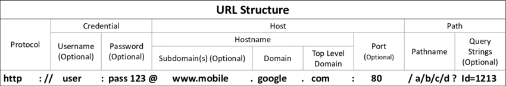
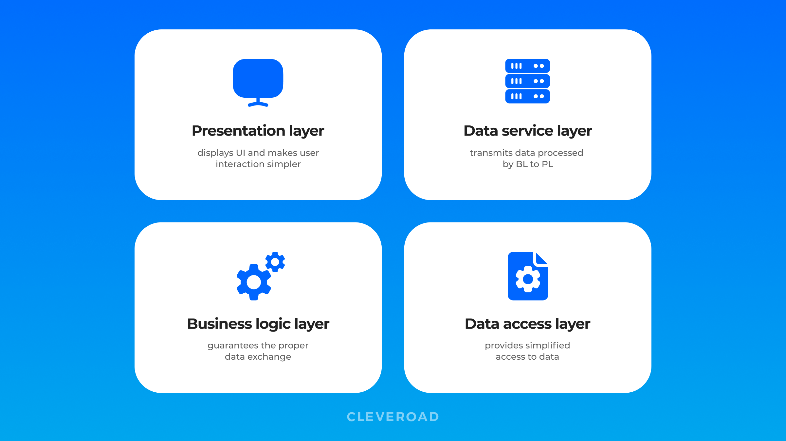
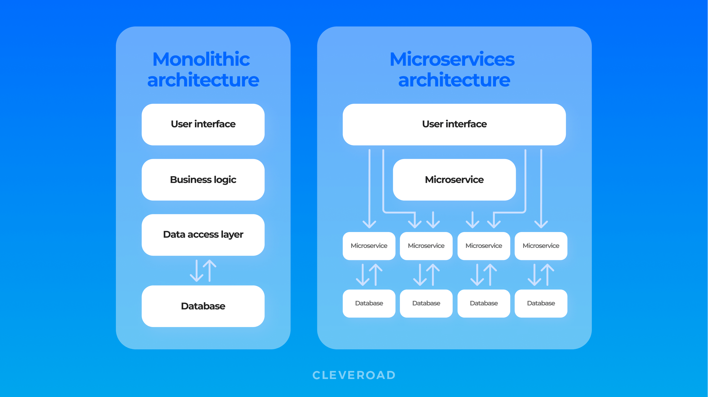

# 📓 Theory (HTTP/Web)

## HyperText Transfer Protocol (HTTP)

Hypertext Transfer Protocol (HTTP) is an application layer protocol for the transmission of hypermedia documents, such as HTML, and allows us to access World Wide Web resources. It follows the classic client-server model, in which a client establishes a connection, makes a request to a server and waits for a response from the server. It is a stateless protocol, which means that the server does not store any data (state) between two requests. When we want to visit a website, we enter a **Fully Qualified Domain Name** (**FQDN**) as a **Uniform Resource Locator** (**URL**):

## URL

URL stands for Uniform Resource Locator. A URL is nothing more than an address that is given to a unique resource on the Web. Its structure is as follows:

Explanation:

* **Protocol (or scheme)**: Identifies the protocol accessed by the client. It is usually HTTP or HTTPS but there are also others.
* **Credential** (or **user info**): This is an optional component containing credentials in the `username:password` format, which is used to authenticate to the host. Finally, the **@** character is used to separate the host.
* **Host**: The host is the location of the resource. It can be a host name (containing domain names) or an IP address.
* **Port**: Port number which, if not specified, will default HTTP schemes to port 80 and HTTPS schemes to port 443. The port is separated from the host by a colon (`:`).
* **Path**: Points to the accessed resource (file or directory). If no path is specified, the server returns the default index which is usually `index.html`.
* **Query String**: The query string consists of a parameter and a value (for example: `id=1`). It starts with a question mark (**?**). Multiple parameters can be separated by an ampersand (**&**).

## Requests and Responses (HTTP)

### HTTP request

The first line of an HTTP request contains three fields separated by spaces:

* **Method**: The first field represents the HTTP method or verb, which specifies the type of action to be performed. Some common methods are GET and POST.
* **Path**: The second field is the path to the resource being accessed (it can also be suffixed with a query string).
* **Version of the protocol**: Used to denote the HTTP/S version.

The following lines contain HTTP header value pairs, where they are used to specify various attributes of a request. The headers end with a new line, necessary for the server to validate the request. A request can end with the request body and data.

### HTTP response

* **Version of the protocol**: HTTP version
* **Status code**: **** Indicates the status of the request, for example, whether it was successful or unsuccessful.
* **Status Message**: A brief description of the status code.

Finally, there is the body of the response after the headers, separated by a new line. The response body can be in different formats, such as HTML, JSON, images, etc.

## HTTP Headers

HTTP headers allow the client and server to send additional information along with a request or response. There are many header categories:

* General headers
* Entity headers
* Requests headers
* Response headers
* Security headers

### General Headers

Headers that apply to both requests and responses, but are unrelated to the data ultimately transmitted in the body. They are used to describe the message rather than its content.

### Entity Headers

Headers that contain more information about the body of the entity (content), such as the size of the content or its MIME type. They are usually found in responses and in POST or PUT requests.

### Request Headers

Headers that are used in an HTTP request and are not related to the content of the message.

### Response Headers

Headers containing more information about the content, such as its origin or the server (name, version, etc.), which are used to provide more context about the response.

### Security Headers

HTTP security headers are a class of response headers that are used to specify certain rules and policies that the browser must follow when accessing the website.

## HTTP Methods and Codes

### Requests Methods

Multiple HTTP methods can be used to access resources. Let's take a look at some of the most commonly used methods.

| Method      | Description                                                                                                                                                                                                                                                                                                    |
| ----------- | -------------------------------------------------------------------------------------------------------------------------------------------------------------------------------------------------------------------------------------------------------------------------------------------------------------- |
| **GET**     | This is the most common HTTP method, requesting a specific resource. Additional data can be passed to the server via query strings.                                                                                                                                                                            |
| **POST**    | This is another common method used to send data to the server and is commonly used when sending information or uploading data to a website. It can handle multiple types of input, such as text, PDFs and other forms of binary data. This data is added in the body of the request present after the headers. |
| **HEAD**    | Asks for a response identical to that of a GET request, but without the response body. This is useful for retrieving meta-information written in response headers, without having to transport the entire content.                                                                                             |
| **PUT**     | This method is similar to POST in that it is used to create new resources on the server. The problem with this method is that if it is misconfigured, it can lead to the addition of malicious resources.                                                                                                      |
| **DELETE**  | This method allows users to delete an existing resource on the web server.                                                                                                                                                                                                                                     |
| **OPTIONS** | The HTTP OPTIONS method is used to describe the communication options for the target resource. This method allows the client to determine the options and/or requirements associated with a resource, or the capabilities of a server, without implying a resource action or initiating a resource retrieval.  |
| **PATCH**   | Method for making partial changes to an existing resource.                                                                                                                                                                                                                                                     |

### Response Codes

HTTP status codes are used to indicate to the client the status of its request:

| Type | Description           |
| ---- | --------------------- |
| 1xx  | Informative responses |
| 2xx  | Successful responses  |
| 3xx  | Redirects             |
| 4xx  | Client errors         |
| 5xx  | Server errors         |

## **Web Applications**

### Introduction

A web application is an interactive application software that runs on a web server, where the user accesses it through a web browser. Web applications usually adopt a client-server architecture to run and manage interactions. They usually have front-end components that run on the client side (browser) and other back end components that run on the server side (back end server).

These web applications allow companies to host powerful applications with near real-time control over their design and functionality, while being accessible worldwide.

The amazing thing about this is that they can be developed by any web developer and hosted online in any of the hosting services on the market, and then used by anyone on the Internet.

#### Web Applications vs. Websites

In the first stage of the evolution of the World Wide Web (known as Web 1.0) there were only websites with static pages hosted on web servers managed by ISPs or free web hosting services. It was not possible to implement any kind of real-time interaction with the user.

Web 2.0 presents dynamic content based on user interaction, i.e., they are fully functional and can perform various functions for the end user, while websites lack this feature.

#### Web Applications vs. Native Operating System Applications

* **Multiplatform**: While web applications are platform-independent and can run in a browser on any operating system, OS-native applications are the opposite.
* **Installation**: Native OS applications are installed prior to use, whereas web applications do not have to be installed on the user's system because they run remotely on a remote server.
* **Disk**: Because web applications do not need to be installed, they do not consume any space on the end user's hard disk. The opposite is true for native operating system applications.
* **Version unity**: In a web application, all users use the same version and the same web application, where it can be continuously updated and modified without the need to send updates to each user. In the case of native operating system applications, it is necessary to send notifications of an update to the user.
* **Updates**: While web applications can be updated at a single remote location, native OS applications need to develop different builds for each platform.
* **Speed**: Native applications are built to use the OS native libraries, therefore, they are much faster to load and interact with than web applications.
* **Capabilities**: Web applications suffer from a limitation in which are the capabilities of web browsers. However, native applications tend to be more capable as they have a deeper integration with the operating system.

In addition to web and native applications, there are the increasingly common hybrid and progressive web applications, which use modern frameworks to run web applications using the capabilities and resources of the native operating system.

### Web Application Layout

It is important to understand the different ways in which web applications can work behind the scenes, the structure of a web application, its components and how they can be configured within a company's infrastructure.

Web application designs can be divided into the following three main categories:

* **Infrastructure**: The infrastructure describes the structure of the components necessary for the web application to function as intended. An example of these components may be a database.
* **Components**: Components that make up a web application represent all the components with which the web application interacts, which can be divided into the following two categories: User interface components (UI/UX) structural components (Client and Server).
* **Architecture**: Web application architecture describes the interactions between applications, databases and middleware systems on the web, i.e. the relationships between these components.

### Infrastructure (Web Application)

The most common models or types of infrastructure for a web application are as follows:

* Client-Server
* One Server
* Many Servers - One Database
* Many Servers - Many Databases


There are other web application models such as [serverless](https://aws.amazon.com/lambda/serverless-architectures-learn-more) web applications or web applications using [microservices](https://aws.amazon.com/microservices).


#### Client-Server

The client-server model is often adopted by web applications. A server hosts the web application and distributes it to clients trying to access it, where this application has two types of components: The front end (client side) and the back end (server side). It should be clarified that although most web applications use a front-back end client-server architecture, there are many design implementations.

#### **One Server**

It is the most simple as well as the least reliable web app component model. Such a model uses a single server as well as a single database. A web app builds on such a model will go down as soon as the server goes down. Hence, it isn’t much reliable.

One web server, one database web application component model is not typically used for real web applications. It is mostly used for running test projects as well as with the intent of learning and understanding the fundamentals of the web application.

#### **Many Servers - One Database**

The idea with this type of model is that the database is on its own database server and allows the web application hosting server to access the database server to store and retrieve data.

For this model of web application component at least 2 web servers are needed, where the web applications access a single database to have access to the same data without the need to synchronize data between them.

If a web server hosting a web application "crashes", all requests made will be automatically redirected to the new server and the web application will continue to run. Therefore, the reliability is higher compared to the single server model with inherent database. However, if the database goes down, the web application will continue to do the same.

#### **Many Servers - Many Databases**

This is the most efficient web application component model because neither the web servers nor the databases have a single point of failure. The web application can only access private data and only common data that is shared between web applications. It is also possible to host the database of each web application on its own database server. It can even be used for redundancy purposes (backup in case a DB goes down).

Whichever way it is used, this structure is the best option in terms of security, applying access control measures and asset segmentation.

### Components (Web Application)

While each web application has a different number of components, the above models generally have the following:

* **Client**
* **Server**: Webserver, Web Application Logic, Database.
* **Services** (Microservices): 3rd Party Integrations, Web Application Integrations.
* **Functions** (Serverless)

### Architecture (Web Application)

The architecture of a web application is a pattern of interaction between various components of the web application. The type of web application architecture depends on how the application logic is distributed between the client and server side.

#### Layers of Web App Architecture

Let’s categorize the most common web application architectures by dividing them into the user part and client part:

**Frontend side**:

* Single-page web apps
* Multi-page web apps

**Backend side**:

* Microservices architecture
* Serverless architecture
* Progressive web apps

#### Single-Page App or SPA

SPA stands for a website platform that loads all the required data when you open the page. Single-page apps have one significant benefit - they deliver an amazing user experience since users don’t experience the reloading of a website.

Commonly, Java web application architecture design is applied for single-page solutions. Besides, a wide range of its frameworks like Angular, React, and others are highly useful for designing web application architecture as well. Well-known SPAs: Gmail, Facebook, Twitter, Slack

#### Multi-Page App or MPA

Multi-page applications are more popular on the Internet since all the websites used to be MPA in the past. These days, companies choose MPAs in case the solution is pretty large (like eBay). Such solutions reload a web page to load or send information from/to a server via the users’ browsers. Well-known MPAs: eBay, Amazon

#### Microservices Architecture

To understand the benefits of microservices architecture, it’s better to compare it with the monolithic model. The traditional monolithic architecture of a web application consists of three parts: a database, a client-side, and a server side. It means that backend and frontend logic, just like other background tasks, are generated in one codebase. Thus, to edit or update the app component, software engineers have to rewrite the whole application. Monolithic applications are great for projects with elementary requirements, and the solution can cope with bounded traffic loads. In practice, it can be a web solution estimating taxes of an enterprise. As for microservices, this approach lets developers create a web app from a set of small services. Then, developers build and deploy each component separately. To illustrate, a microservice option may be used in common social networking platforms comprising different elements like online chat, notifications, video streaming service, posting photos, and other features allowing social interaction. Microservices' technical architecture of web applications is beneficial for large and complex projects requiring high level web application since each service may be edited to prevent the damage of other blocks. So if you needed to update a payment logic, you wouldn’t have to pause the website’s work for a while. Well-known projects: Netflix, Uber, Spotify, PayPal

The following image comprises a comparison of monolithic and microservices web application architecture diagram:

#### Serverless Architecture

This type of architecture makes developers use a cloud web application infrastructure from third-party service providers like Amazon and Microsoft. What does it mean? To keep a web application network architecture on the Internet, developers should manage a server infrastructure (virtual or physical), an operating system, and other server-related hosting processes. Cloud providers like Amazon or Microsoft offer virtual servers that dynamically manage the allocation of machine resources. In other words, if your app experiences a considerable traffic load your servers aren’t ready for, the app won’t be down.

#### Progressive Web Apps or PWA

One of the primary trends in web app development of the last few years is progressive web applications. They are web-based application architecture solutions designed to act like native apps on mobile devices. PWAs offer push notifications, offline access, and a capacity to install an app on your device. To create a PWA, developers use web programming languages like HTML, CSS, and Java web application architecture. If the app needs access to devices' features, developers use extra APIs — NFC API, Bluetooth API, Geolocation API, and others. We all know such world-famous companies as Uber, Starbucks, Pinterest, which websites are PWA’s.


Reference


### Front end

The front-end of a web application contains the user's components directly through their web browser (client-side), which are the source code of the web page that we see when visiting a web application, where they usually include HTML, CSS and JavaScript, which are then interpreted in real time by our browsers (Chrome, Firefox, etc.).

The frontend includes everything the user sees and interacts with, such as the main elements of the page, the layout and animation of all CSS elements, and what function each part of a JavaScript page performs.

As it is the "visible face" for all users, we need it to be adaptable to any platform and screen size. For example, it is not the same to visualize the web application on an Iphone 13 than on a PC. In addition, it must be well optimized to ensure the user experience.

Tasks related to front end web application development:

* Visual Concept Web Design
* User Interface (UI) Design
* User Experience (UX) Design

### Back end

The back end drives all the core functionality of the web application, all of which runs on the back end server, which processes everything necessary for the web application to function properly.

There are four main components of the back end of web applications:

* **Back end servers**: The hardware and operating system that hosts all other components and are typically run on operating systems (Linux, Windows, etc.) or using containers (such as Docker).
* **Web servers**: They manage HTTP requests and connections. Examples: Apache, NGINX, IIS, etc.
* **Databases**: They store and retrieve the web application data which can be relational databases (MySQL, MSSQL, Oracle, etc.) or non-relational databases (NoSQL and MongoDB).
* **Development frameworks**: They are used to develop the core of the web application. Examples: PHP (Laravel), C# (ASP.NET), Java (Spring), Python (Django, Flask) and JavaScript (Vue, NodeJS).

### Back End Server

The back-end server is the hardware that handles all the logic, processes and tasks for running the web application.


The back-end server is located in the data access layer.


#### Software

The back end server contains many components:

* Web server
* Database
* Development framework
* Hypervisors (not necessary)
* Containers (not necessary)
* WAFs (not necessary)

In addition to the components mentioned above, there are popular combinations of "stacks" for back-end servers, which contain a set of components. Examples:

* **LAMP**: Linux, Apache, MySQL and PHP.
* **WAMP**: Windows, Apache, MySQL and PHP.
* **WINS**: Windows, IIS, .NET and SQL Server.
* **MAMP**: macOS, Apache, MySQL and PHP.
* **XAMPP**: Cross-Platform, Apache, MySQL and PHP/Perl.

#### Hardware

The back-end server must obviously be stable and be able to handle multiple web requests. However, the server does not necessarily need to have the best hardware, as we can distribute the load among many back-end servers.

### Databases

Databases are used to store various content and information related to the web application. This allows web applications to interact, store and retrieve data easily and quickly and allows for different dynamic content for each user.

Developers must choose the type of database, having a focus on the long term, because if the web application is intended for the entire audience, the size of the data will grow along with the scalability and cost.

#### Relational (SQL)

Relational databases (SQL) store their data in tables, rows and columns. Each table can have unique keys, which can link the tables together and create relationships between them (this relationship between tables in a database is called a schema).

Examples of relational databases: MySQL, MSSQL, Oracle, PostgreSQL, SQLite, MariaDB, Amazon Aurora and Azure SQL.

#### Non-relational (NoSQL)

A non-relational database (NoSQL) stores data using various storage models, depending on the type of data stored, where the most common ones are:

* Key-Value
* Document-based
* Wide-column
* Graphical


Each has a different way of storing data.


Most common NoSQL databases: MongoDB, ElasticSearch, Apache Cassandra, Amazon DynamoDB**,** Redis, Neo4J, CouchDB, etc.
